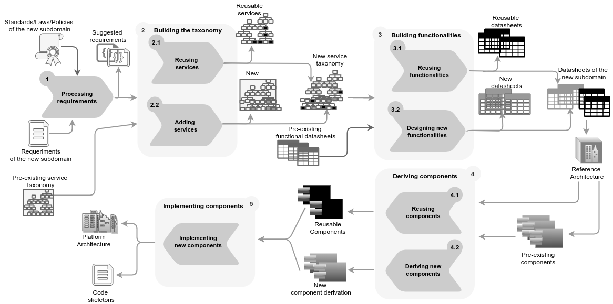

# Tools for SPL development methodology based on domain hierarchy

In this project we show tools developed for our SPL development methodology.

The methodology is  supported by a process for building functionalities based on a specific domain hierarchy.

Our approach is functionality oriented, that is, the activities are focused on building functionalities of a new or existing domains taking into account  available components of the model.

In the following figure we can see the process split into two main branches (from the second to the fourth activities), which respectively denote the task of reusing or creating domain assets.
Thus, the process showed in the Figure is defined from the point of view of creating new functionalities for a new subdomain, considering existing domain assets.

In the figure we can see the creation of several software artifacts. We create a set of different tools for supporting the creation and manipulation of several of them.

## Tool for taxonomy manipultation

TaxView.jar is a Java tool for taxonomy manipulation. With this tool you can explore, edit and delete services of our taxonomy.

## New tool for taxonomy manipulation

TaxManipulation tool is available at `https://github.com/IngSisFAI/TaxManipulation`. It adds more capabilities for adding, editing, deleting and searching services, and
even with better search engines.

## Tool for searching reused services

ServiceMapper.jar is a Java tool designed for finding the best service candidates of the taxonomy to fulfill a requirement of the new subdomain.
By taking a required service (or requirement) as input, the tool performs two main activities, preprocessing and indexing, and searching. In the
preprocessing step, the WordNet lexical database is used to analyze and enrich each of the terms or sets of terms obtained from the requirement and the services of the taxonomy.
Then, in the next step, indexing and searching, by using the Lucene search engine, the documents generated in the previous step are indexed to allow the search engine to find
the set of relevant services for the required service.

Thus, the ServiceMapper tool can be used to obtain the suggested list of candidate services. They must enter the requirement written in natural language, and the tool enriches
the text and indexes it to find possible correspondences in the taxonomy. From these candidates, users must decide if the requirement can be fully supported by some candidate,
or the required service must be added as an specialization or as a completely new service.

## Tool for designing datasheets

Datasheet Modeler (pluginModelado) is a Java tool for creating datasheets graphically and translating them to XML files. THis tool must be modified  in
order to translate to JSON files, as required in the rest of tools.

## Tool for validating variability models

SeVaTax tool is available at `https://github.com/IngSisFAI/sevataxtool`

The tool only accepts inputs as JSON files. Examples of datasheets can be found in src/assets/datasheet

## Tool for variability model generation

Available at `https://github.com/IngSisFAI/variabilityModelGenerator`

 The tool automatically generates variability models adapted to SeVataX models

## Publications

A. Buccella, A. Cechich, M. Arias, M. Pol’la, S. Doldan, and E. Morsan. Towards systematic software reuse of gis: Insights from a case study. Computers & Geosciences, 54(0):9 – 20, 2013.

A. Buccella, A. Cechich, M. Pol’la, M. Arias, S. Doldan, and E. Morsan. Marine ecology service reuse through taxonomy-oriented SPL development. Computers & Geosciences, 73(0):108-121, 2014.

F. Pesce, S. Caballero, A. Buccella, and A. Cechich.  Reusing a geographic software product line platform: A case study in the paleontological sub-domain.  In Armando Eduardo De Giusti, editor,Computer Science – CACIC2017, pages 145–154, Cham, 2018. Springer In-ternational Publishing.

A. Buccella, M. Pol’la, M. Arias, and A. Cechich.Taxonomy-based annotations for software product line development. In 17th Simposio Argentino de Ingeniería de Software (ASSE’16) en el marco de las45  Jornadas  Argentinas  de  Informática  (JAIIO),Buenos Aires, Argentina, 2016.

A. Buccella, A. Cechich, J. Porfiri, and D. Diniz Dos Santos. Taxonomy-Oriented Domain Analysis of GIS: A Case Study for Paleontological Software Systems.ISPRS International Journal of Geo-Information8,6 (2019).   https://doi.org/10.3390/ijgi806027020

 A. Buccella,  M. Pol'la, E. Ruiz de Galarreta, A. Cechich, A. Combining Automatic Variability Analysis Tools: An SPL Approach for Building a Framework for Composition.  Computational Science and Its Applications - ICCSA 2018 - 18th International Conference, Melbourne, VIC, Australia, July 2-5, 2018, Proceedings, Part IV. Springer, 2018, Vol. 10963, Lecture Notes in Computer Science, pp. 435–451.  doi:10.1007/978-3-319-95171-3_34.

 M. Pol'la, A. Buccella, A. Cechich. Using Scope Scenarios to Verify Multiple Variability Models. 19th International Conference on Computational Science and Applications ICCSA (5) 2019: 383-399. Lecture Notes in Computer Science  11619-11624 ISBN-10 : 3030242889.

 M. Pol'la, A. Buccella,  A. Cechich. Analysis of variability models: a systematic literature review. Software and Systems Modeling (2020). https://doi.org/10.1007/s10270-020-00839-w. ISSN 1619-1366. E-ISSN 1619-1374.

 G. Braun,  M. Pol’la,  L. Cecchi, A. Buccella, P. Fi-llottrani, and A. Cechich.  A DL semantics for reasoning over ovm-based variability models.In Proceedings of the 30th International Workshop on Description Logics, Montpellier, France, July18-21, 2017.

 A. Buccella,  M.  Pol’la,  E. Ruiz de Galarreta, and A. Cechich.  Combining automatic  variability  analysis  tools:  An  spl  approach for building a framework for composition.In O. Gervasi, B. Murgante, S. Misra,  E. Stankova,  C. M.  Torre, etol editors. Computational  Science  and  Its  Applications – ICCSA 2018, pages 435–451, Cham, 2018.Springer International Publishing.

## Acknowledgments

 This work is partially supported by the UNComa project 04/F009 "Reuso de Software orientado a Dominios - Parte II" part of the program "Desarrollo de Software Basado en Reuso - Parte II."

